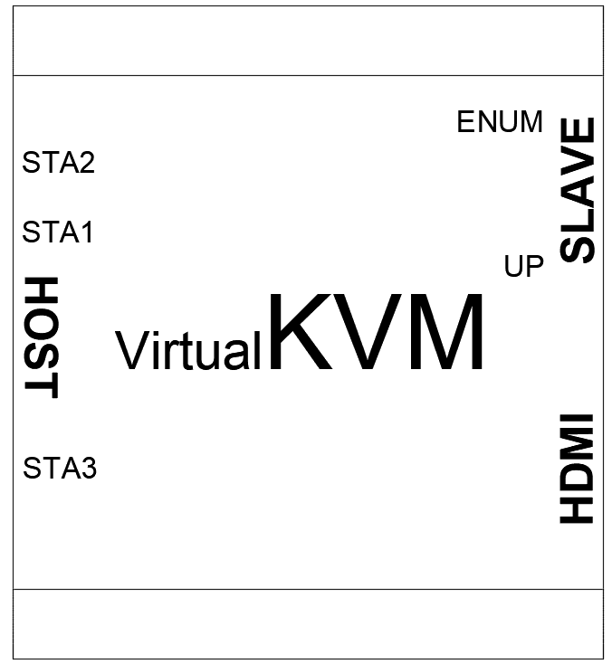
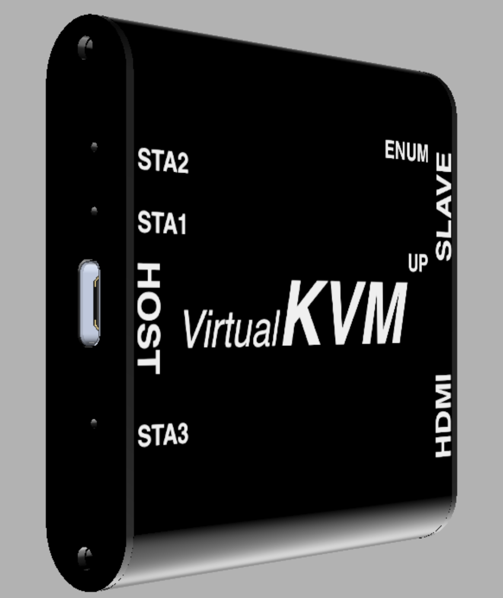
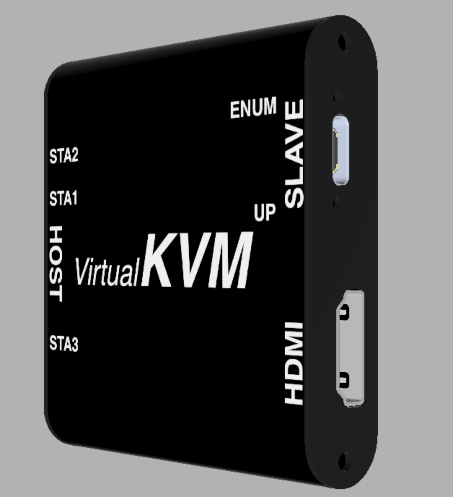

<!--
 * @Description: 
 * @Date: 2020-09-01 23:29:53
 * @LastEditors: CK.Zh
 * @LastEditTime: 2021-01-09 00:41:21
 * @FilePath: \virtual_kvm_doc\README.md
-->
# Virtual KVM

### 🛒购买直达：[淘宝店铺](http://store.trans.link/)

## 特性

* USB typeC？ 简直标配，不值一提
* 全平台免驱、即插即用
* 可能是全球首款虚拟KVM
* 能看会控
* 玩转树莓派，何必再需~~键盘、鼠标、显示器~~
* 身材mini，功能MAX

## 场景

> `一台电脑 + Virtual KVM` 可以让你如此大展身手：

* 录制软件教程
* 批量安装计算机操作系统
* 树莓派、Jetson Nano等开源硬件调试

（以下待验证）
* Smartisan OS TNT
* 三星手机PC模式
* 华为手机PC模式
* iOS设备投屏
* 电视盒子
* Switch

## 快速开始

1. 使用USB线连接`HOST`口到主机电脑
2. 使用USB线连接`SLVAE`口到被控设备，使用HDMI线连接`HDMI`口到被控设备视频输出口
3. 在主控电脑上打开`VirtualKVM APP`

## 客户端下载

 https://github.com/translink/virtual_kvm_doc/releases
 
## 客户端功能

| 菜单  | 功能                          | 备注 |
|-------|-------------------------------|--------|
| `输入`  | 选择视频流输入设备 | 默认选择为VirtualKVM硬件 |
| `画质` | 选择客户端内画面尺寸及比例 | 默认选择为 16:9   建议设置为与被控机相同的分辨率或画面比例 |
| `声音`  | `输入`   `输出`   | 选择或禁用主控机的声音来源     选择或禁用主控机的声音输出 |
| `捕获`  | `截屏`    ~~`开始录像`~~   `更改文件夹`    `打开...`| 截取被控机当前画面为图片    ~~录制被控机当前画面为视频~~（该功能暂不可用）   选择截屏/录像文件保存位置    打开截屏/录像文件的存储目录 |
| `输出` | 选择键鼠数据流输出设备                  | 默认选择为VirtualKVM硬件 |
| `模式`  | `默认`   `类Unix` | 被控机为`Windows`平台时选择     被控机为`Linux`、`Android`、`macOS`等类Unix平台时选择 |
| `关于`  | `帮助`   `关于` | 查看帮助文档及软件更新   客户端软件的构建信息 |
| `显示`  | `光标`   `全屏` | 设置是否显示主控机本身的光标      设置客户端软件进入/退出全屏 |

## 硬件接口及指示灯

| 接口  | 功能                          | 连接至 |
|-------|-------------------------------|--------|
| `HOST`  | 视频数据流输出   键鼠数据流输入 | 主控机 |
| `SLAVE` | 键鼠数据输出                  | 被控机 |
| `HDMI`  | HDMI视频数据输入              | 被控机 |

******

| 指示灯| 功能             | 常亮●               | 熄灭○               | 闪烁◐                   |
|------|------------------|--------------------|--------------------|------------------------|
| `STA1` | 视频采集（硬件） | 工作中             | 未工作             | N/A                    |
| `STA2` | 键鼠模拟（硬件） | 工作中             | 未工作             | N/A                    |
| `STA3` | 预览画面（软件） | 主控机正在预览画面 | 主控机未在预览画面 | N/A                    |
| `ENUM` | 键鼠枚举（软件） | 被控机已识别键鼠   | 被控机未识别键鼠   | N/A                    |
| `UP`   | 键鼠通信（软件） | N/A                | N/A                | 键鼠数据发送至被控机 |

## 兼容平台

| 操作系统  | 状态                          |
|-------|-------------------------------|
| Windows 10  | 已发布 |
| Windows 7 | 已开发、未测试                  |
| Ubuntu 20.04  | 规划中              |
| macOS | N/A                  |
| Android | N/A                  |
| iOS | N/A                  |

## 常见问题

* “`ENUM`灯已点亮，为什么主控机无法控制被控机？”

    如果被控机是`Windows`平台，请在客户端软件的`模式`选项中点选`默认`
    如果被控机是`Linux`、`Android`、`macOS`等类Unix平台，请在客户端软件的`模式`选项中点选`类Unix`

* “为什么在客户端看到的画面模糊/有畸变？”

    请将客户端的`画质`设置为与`被控机`输出分辨率相同
    或设置两者的画面比例为相同

* “被控机是笔记本或已经连接了显示器，该如何使用VirtualKVM？”

    请将`被控机`的显示输出设置为`镜像模式`

* “如何使被控机的声音通过主控机输出？”

    * 设置`被控机`的音频输出为`HDMI`
    * 确保所用HDMI线支持音频传输
    * 取消`主控机`麦克风静音（部分笔记本可能具有类似功能），麦克风权限对VirtualKVM开放

* “哪些设备可以作为被控机？”

    树莓派、JetsonNANO、笔记本电脑、台式电脑、电视盒子、Nintendo Switch、Smartisan TNT、三星手机PC模式、华为手机PC模式.....
    
    理论上任何支持HDMI输出和键鼠输入的设备都可使用
